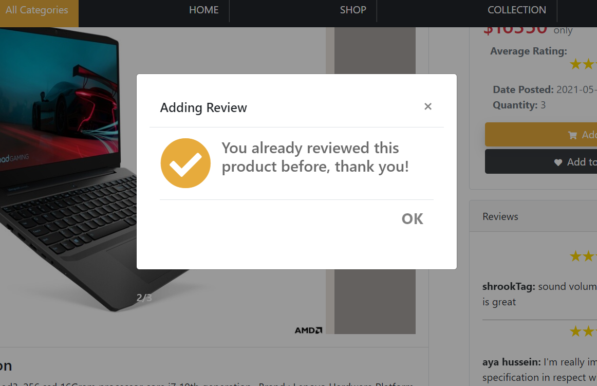
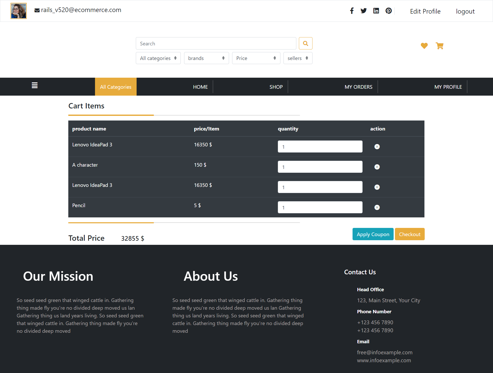
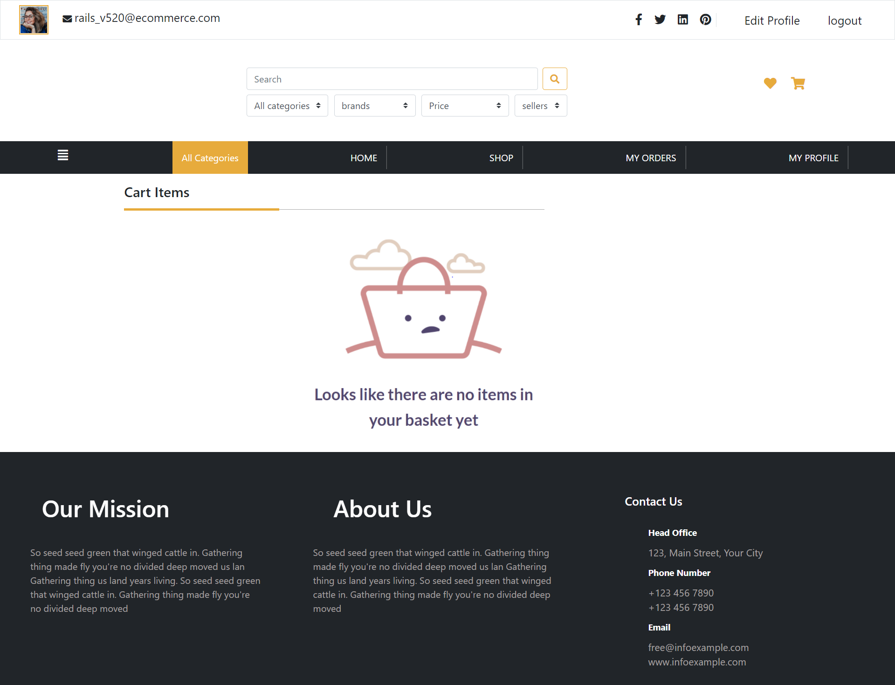
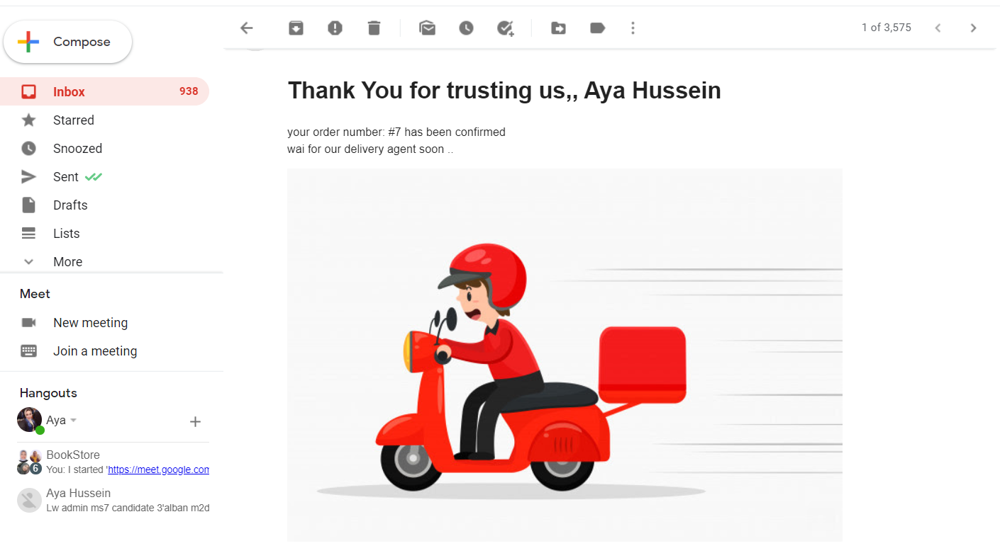
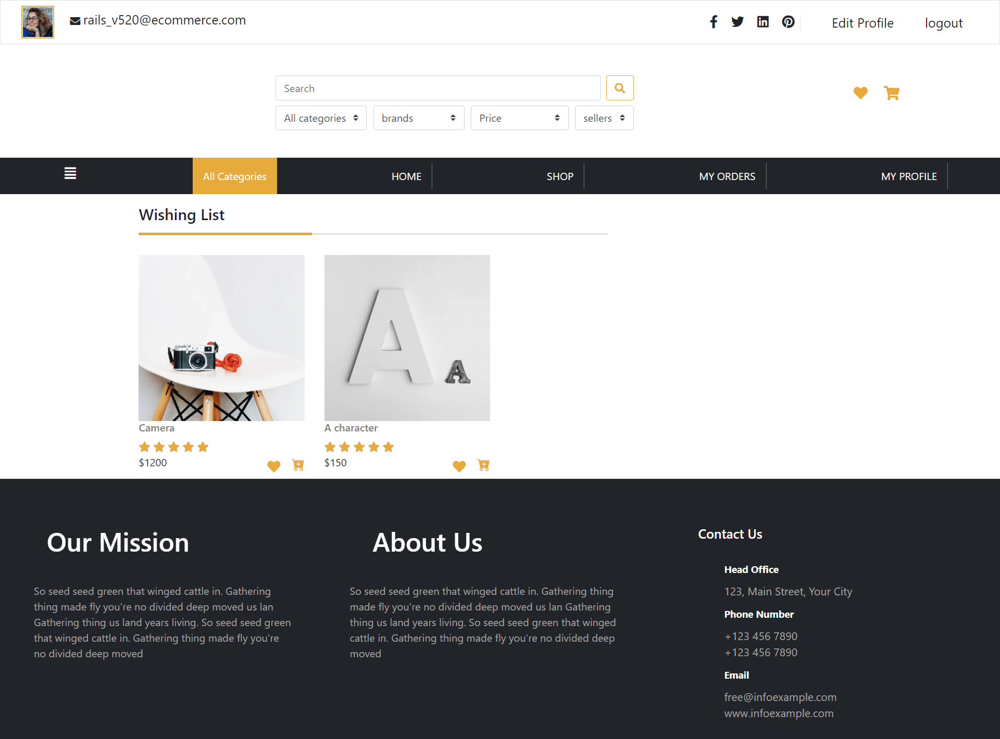
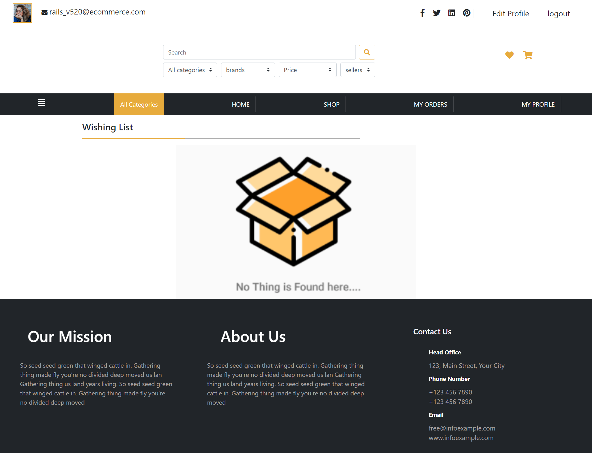

# eCommerce Ruby on Rails Project Preview

## Database Structure (ERD)

## Steps to run project in development mode 
#### </ins>First:</ins> install npm in your machine
#### <ins> Second:</ins>install ruby on your machine
#### <ins>Third:</ins>install rails on your machine
#### <ins> Fourth:</ins> install sqlite3 or postgres in your machine 
#### Then run these commands:
##### >>    bundle install
##### >>    rails db:create
##### >>    rails db:migrate
##### >>   rails db:seed
##### >>    rails  s 
To login as a buyer or seller  visit url: http://localhost:3000  
To login as an admin or seller visit url: http://localhost:3000/admin

##### Username and password for Admin:
Email: admin@example.com                      Password: password
##### Username and password for seller
Email: seller@example.com                     Password: password

to test user model : rails t test/models/user_test.rb

## Home Page

## Product Page

### only buyer who purchased the product can review it

### buyer can review only once

## Cart Items

### in case of no cart items

## Order status notification
### Notifying buyer when his order confirmed

### Notifying buyer when his order delivered

## My Orders

### in case of no orders yet

## Wishing List Items

### in case of no wishing list items items

## profile

### Design patterns  
#### Query Objects
Query Object a type of design patterns in rails that lets us fetch query logic from Controllers and Models into reusable classes.
#### Form Objects
The form object is a design pattern that is used to encapsulate the code related to validation and persisting data into a single unit.

