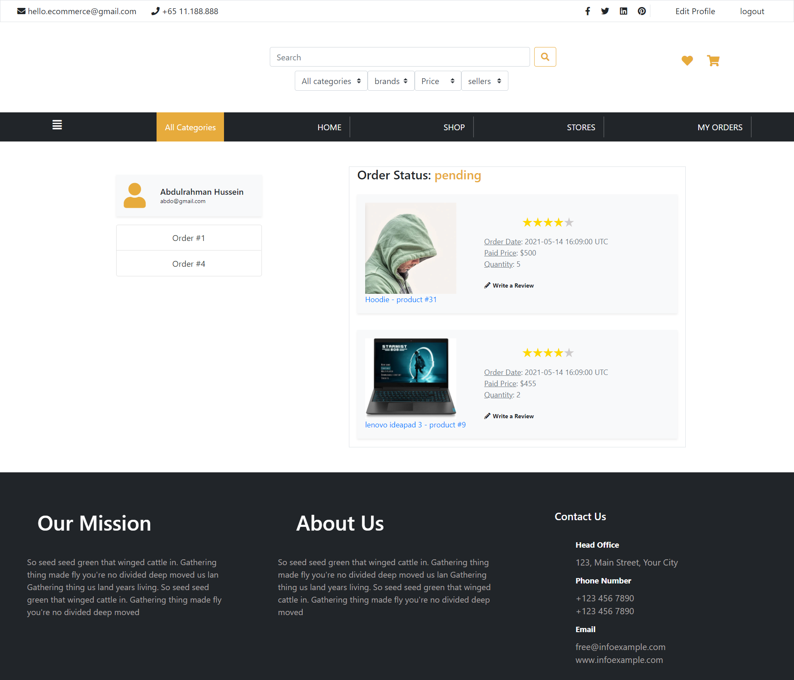
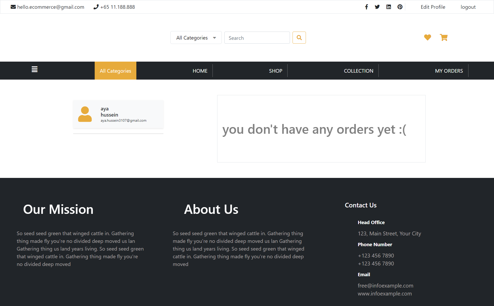
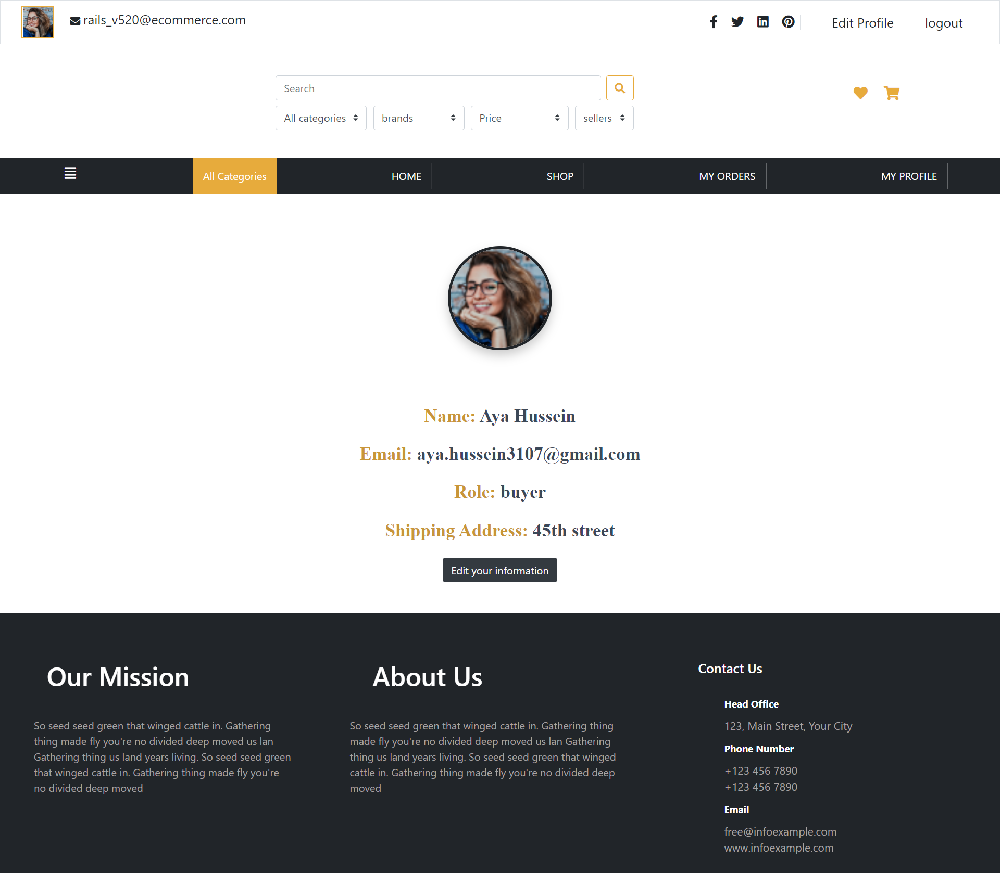

# eCommerce Ruby on Rails Project Preview

# steps to run project on development mode
        1- install npm in your machine
        2- install ruby on your machine
        3- install rails on your machine
        4- install sqlite3 or postgres in your machine 
             then run these commands:
                  -   bundle install
                  -   rails db:create
                  -   rails db:migrate
                  -   rails db:seed
                  -   rails  s 

## Database Structure (ERD)

## Home Page

## Product Page

### only buyer who purchased the product can review it

### buyer can review only once

## Cart Items

### in case of no cart items

## Order status notification
### Notifying buyer when his order confirmed

### Notifying buyer when his order delivered

## My Orders

### in case of no orders yet

## Wishing List Items

### in case of no wishing list items items

## profile

